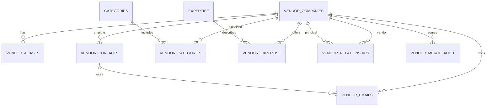

# Normalized Vendor Master

## Migration and cutover

Migration `20260804013000_normalize_vendor_master.sql` is additive. It creates an immutable `vendors_legacy_snapshot_20260804`, makes `public.vendors` read-only, and conservatively groups only exact canonical names. It never performs fuzzy merges or infers OEM relationships. The current PO foreign key remains on the legacy table during the transition; the Vendor Directory itself reads only the normalized model.

Canonical normalization lowercases, removes a leading `PT`, replaces punctuation with spaces, and collapses whitespace. Similar names are duplicate **candidates**, not automatic matches. The listed standardized names flow through the same conservative rule. Relationship examples in the brief are intentionally not seeded without stable IDs/evidence.



## Safe merge flow

1. Editor selects an active source and target and reviews counts returned by the preview.
2. The client sends source, target, and the source `updated_at` concurrency token.
3. `merge_vendor_companies` locks both records and rechecks role and token.
4. Contacts, email, category, expertise, aliases, and relationships move transactionally; conflicts are de-duplicated.
5. Source legal name becomes a target alias. Source is retained with `status=merged` and a target pointer.
6. The immutable preview, actor, and timestamp are written to `vendor_merge_audit`.

## Production validation queries

Run after `supabase db push` and retain output as the migration report:

```sql
select (select count(*) from vendors) legacy_now,
       (select count(*) from vendors_legacy_snapshot_20260804) legacy_snapshot,
       (select count(*) from vendor_companies) companies,
       (select count(*) from vendor_contacts) contacts,
       (select count(*) from vendor_emails) emails,
       (select count(*) from vendor_expertise) expertise_links,
       (select count(*) from vendor_categories) category_links,
       (select count(*) from vendor_relationships) relationships;

-- Must return 0.
select count(*) missing_emails from (
  select lower(btrim(e)) email from vendors v,
  lateral unnest(regexp_split_to_array(coalesce(v.emails::text,''),'[,;]')) e where btrim(e)<>''
  except select lower(email::text) from vendor_emails
) missing;
select count(*) orphan_count from vendor_contacts c left join vendor_companies v on v.id=c.vendor_id where v.id is null;
select relname, relrowsecurity from pg_class where relnamespace='public'::regnamespace and relname in
 ('vendor_companies','vendor_aliases','vendor_contacts','vendor_emails','categories','vendor_categories','expertise','vendor_expertise','expertise_aliases','expertise_migration_review','vendor_relationships','vendor_merge_audit','vendor_duplicate_decisions');
```

Phone preservation must use the actual audited legacy phone column name. Expertise completeness is the union of `vendor_expertise` and `expertise_migration_review`. Run the Supabase database/security advisors after deployment; this repository has no production credential and cannot truthfully provide production counts.

## Decisions requiring approval

- Confirm expertise synonyms before setting `expertise_aliases.confirmed`; no semantic synonym is preloaded.
- Confirm OEM/distributor mappings and legal entities before adding relationships.
- Decide when PO records should receive a new UUID `vendor_company_id`; legacy PO display fields intentionally remain untouched in phase one.
- Confirm the production legacy contact/email column names surfaced by schema audit before cutover.
